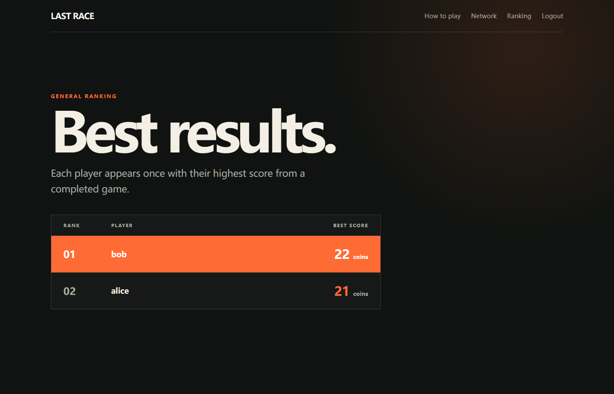
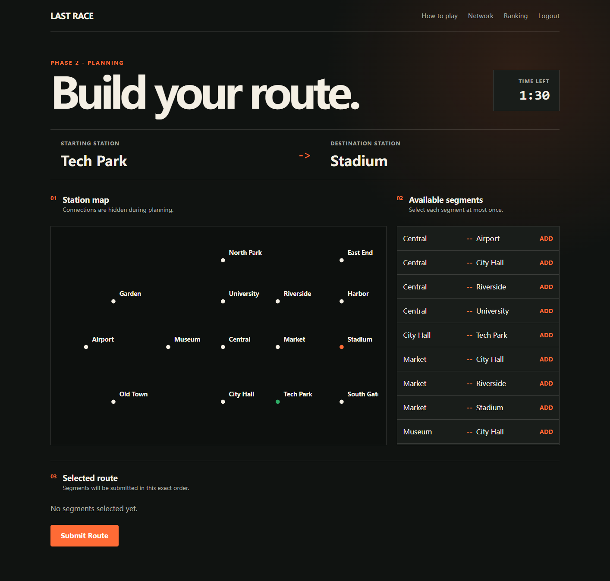

# Exam 1: Last Race

## Student

s353172, Jiang Lingxiao

## React Client Application Routes

- Route `/`: public instructions page. It explains the game and directs guests
  to login or authenticated users to the setup phase.
- Route `/login`: public login page for registered users. A successful login
  redirects to `/setup`, or back to the originally requested protected route.
- Route `/setup`: protected setup page. It displays all stations,
  connections, metro lines, and line names, and allows the user to start a new
  game.
- Route `/game/:gameId/planning`: protected planning page for the game
  identified by `gameId`. It shows station names without connection lines, the
  assigned start and destination, the segment list, the selected route, and a
  90-second timer.
- Route `/game/:gameId/execution`: protected execution page. It reveals the
  generated journey steps and their random events one at a time.
- Route `/game/:gameId/result`: protected result page. It displays whether the
  route was valid, the assigned journey, and the final non-negative score.
- Route `/ranking`: protected general ranking page. It shows each user's best
  score from completed games.

Unknown routes redirect to `/`. The compatibility route `/game` redirects to
`/setup`.

## API Server

Except for login, all game, network, and ranking endpoints require a valid
Passport session cookie. Unauthorized protected requests return HTTP `401`.

### Authentication

- `POST /api/sessions`
  - Body: `{ "username": string, "password": string }`.
  - Authenticates with `passport-local`, creates a server session, and sets an
    HTTP-only session cookie.
  - Returns HTTP `201` with `{ id, username }`.
  - Returns HTTP `401` for invalid credentials.
- `GET /api/sessions/current`
  - Returns the currently authenticated public user `{ id, username }`.
  - Returns HTTP `401` when no valid session exists.
- `DELETE /api/sessions/current`
  - Logs the user out, destroys the session, and clears the cookie.
  - Returns HTTP `204`.
- `GET /api/game`
  - Protected authentication-check endpoint.
  - Returns a welcome message for the current user.

### Network and Games

- `GET /api/network/full`
  - Returns the complete metro network:
    `{ stations, lines, connections }`.
  - Stations include coordinates and their line IDs; lines include name,
    color, and ordered station IDs; connections include their station and line
    IDs.
- `POST /api/games`
  - Creates a game for the logged-in user.
  - The server uses BFS to choose a reachable start/destination pair whose
    shortest distance is at least three segments.
  - Returns HTTP `201` with the game ID, phase, initial coins, creation time,
    start station, and destination station.
- `GET /api/games/:gameId`
  - Returns a summary of the current user's game, including status, phase,
    current coins, score, and assigned stations.
- `GET /api/games/:gameId/planning`
  - Returns `{ gameId, startStation, destinationStation, stations, segments,
    remainingSeconds }`.
  - It intentionally does not return metro-line connection information.
- `POST /api/games/:gameId/route`
  - Body: `{ "selectedSegmentIds": [number, ...] }`.
  - Validates that segments exist, are not repeated, connect in order from the
    assigned start to destination, and only change lines at interchange
    stations.
  - A valid route creates execution steps and returns a completed outcome that
    leads to the execution phase.
  - An invalid route stores score `0`, creates no execution steps, and returns
    the validation reason.
- `GET /api/games/:gameId/execution`
  - Returns `{ gameId, finalScore, steps }`.
  - Each step contains its index, from/to station names, event description,
    event effect, and coins after the step.
- `GET /api/games/:gameId/result`
  - Returns the final game status, route validity, non-negative final score,
    start/destination names, and completion timestamp.
- `GET /api/ranking`
  - Returns `{ ranking }`.
  - Each registered user with at least one completed game appears once with
    their maximum score. Results are sorted by score descending, with dense
    ranking for ties and username as a stable secondary order.

Invalid game IDs return HTTP `400`; inaccessible games return HTTP `404`;
requests incompatible with the current game phase return HTTP `409`.

## Database Tables

- Table `users`: registered players. Stores `id`, unique `username`,
  `password_hash`, and per-user `salt`. Passwords are hashed with `scrypt`.
- Table `stations`: metro stations with `id`, unique `name`, and SVG map
  coordinates `x` and `y`.
- Table `lines`: metro lines with `id`, unique `name`, and unique display
  `color`.
- Table `line_stations`: ordered many-to-many relation between lines and
  stations. `position` defines the station order on a line.
- Table `segments`: unique undirected connections between `station1_id` and
  `station2_id`.
- Table `segment_lines`: many-to-many relation specifying which metro line or
  lines use each segment.
- Table `events`: random journey events with a `description` and coin `effect`.
- Table `games`: game ownership, assigned stations, phase timestamps, planning
  deadline/timeout data, status, and final score.
- Table `planned_route_segments`: the submitted segment IDs and their exact
  order for each game.
- Table `game_steps`: generated execution steps, including segment,
  direction, random event, and coins after the step.

The seed contains 4 lines, 15 stations, 8 events, 3 registered users, and 4
games. Foreign keys, uniqueness constraints, checks, and indexes protect the
main database invariants.

## Main React Components

- `App`: loads the current session, owns login/logout state, and declares the
  application routes.
- `NavigationBar`: displays public or authenticated navigation and performs
  logout.
- `ProtectedRoute`: redirects anonymous users to `/login` while preserving the
  requested path.
- `InstructionsPage`: public game explanation and entry point.
- `LoginPage` and `LoginForm`: handle credential input, submission states,
  errors, and post-login redirection.
- `SetupPage`: loads the complete network and creates a new game.
- `NetworkMap`: draws all metro lines, stations, interchange stations, labels,
  and the line legend with SVG.
- `PlanningPage`: coordinates planning data, selected segments, automatic
  timeout submission, and navigation to execution or result.
- `StationMap`: draws only station positions and names during planning, with
  start and destination highlights.
- `Timer`: formats and displays the planning countdown and urgent state.
- `SegmentList`: displays every available segment and prevents duplicate
  selection.
- `SelectedRoute`: displays selected segments in submission order and exposes
  the submit action.
- `ExecutionPage`: reveals generated game steps and event effects in order.
- `ResultPage`: displays route validity and final score, with play-again and
  ranking actions.
- `RankingPage`: loads and displays each player's best completed-game score.

## Screenshots

### General Ranking

### During a Game

## Users Credentials

- Username: `alice` - Password: `AliceRace!1`
- Username: `bob` - Password: `BobRace!2`
- Username: `carol` - Password: `CarolRace!3`

Passwords are provided only for the seeded exam/demo accounts. The database
stores salted password hashes, not plaintext passwords.

## Use of AI Tools

OpenAI Codex/ChatGPT was used to interpret the exam specification, plan the
database/API/component structure, generate and refactor portions of the code,
and assist with debugging and test design. The generated output was reviewed
and adapted to the project requirements. The final implementation was checked
with database consistency checks, the README screenshots were captured from 
the running application.
